## 前端国际化语言包方案探索

### 前言

一个软件产品要想走向国际市场，在不同的国家和地区使用，必然要在软件设计时考虑国际化，那么国际化是啥呢？维基百科中是这样定义的：

> **国际化** 是指在设计软件时，将软件与特定语言及地区脱钩的过程。当软件被移植到不同的语言及地区时，软件本身不用做内部工程上的改变或修正。

这就要求我们在进行软件开发的时候，不应该为每个语言环境都开发一个单独的版本，这样浪费了大量的开发成本，而应该将需要翻译和替换的文字、图片等资源从代码中提取出来，通过配置文件的形式进行管理。
把抽取后的项目成为**国际化通用版项目**，配置文件称为**语言包**，那么**国际化通用版项目** + 不同语言环境的**语言包**就能够使项目支持不同的语言环境，也就实现了国际化：

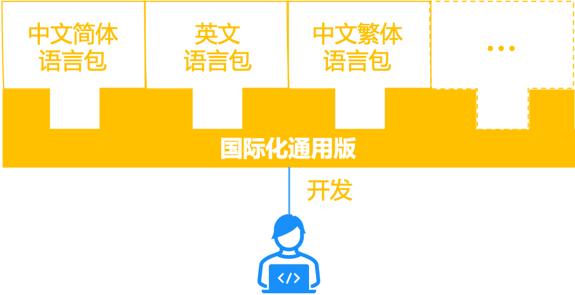

### 现状

有了这个目标，再来看目前基于 Vue 前端项目在进行国际化的时候通常是怎么做的.
大多数情况下我们都选用的是 Vue 官方推荐的 Vue-i18n 方案，使用 Vue-i18n 实现国际化大概需要以下几步：

1. 开发人员使用源语言（中文）开发项目；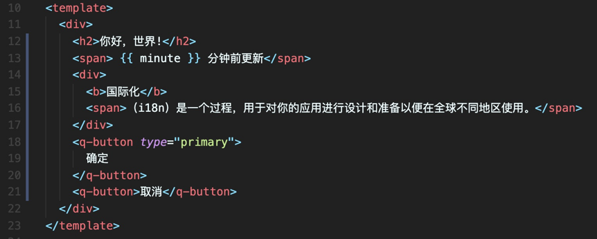
2. 当国际化需求来时，开发人员手动根据源码中的中文抽取语言包定义；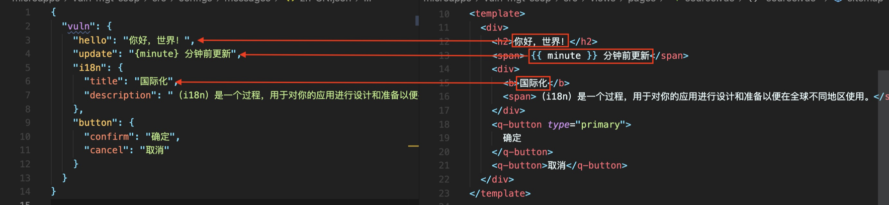
3. 开发人员将代码中源语言文本改写为对应 key 及标记方法；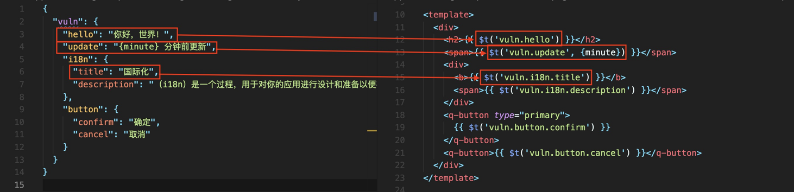
4. 开发人员将源语言包定义整理成翻译人员需要的源语言包，交给翻译人员；
5. 翻译人员翻译完后将目标语言（如英文）包返回给开发人员；
6. 开发人员将目标语言包整理成代码中可用的语言包后，引入项目；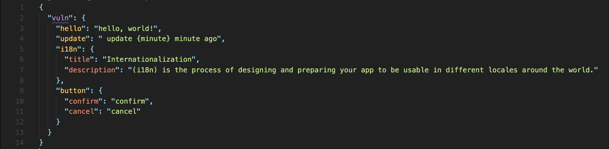

当出现新的需求的时候，需要不断重复上述过程。

如果是规模比较小的项目的话，手动维护起来可能还比较轻松，一旦有一定规模，维护过程就会变得极其繁琐，而且会出现很多问题。

以我司某大型中台项目为例，在决定采用上述国际化方案后，开始了痛苦的维护工作，在整个国际化需求开发过程中，共计“产出”手动定义语言包文件**120**余个，国际化相关 bug **180**余个。

### 痛点分析

在经历了如此开发过程后，我们总结出上述方案在大型项目中应用的以下几个问题：

1. 抽取语言包的过程需要开发人员手动操作，过程繁琐且开发效率低；
2. 代码中充斥大量 key ，不符合中文阅读习惯，维护成本高；
3. 全量加载语言包，导致用户体验差；


出现这些问题的主要原因，还是我们事先没有很好的思考采用现有方案可能带来的问题，并对此进行调研、设计，也是在项目磕磕绊绊上线后，才回过头来思考我们期望的国际化方案应该是什么样的，与上述痛点对应，大概有以下几条：

1. 自动化工具代替大量手动抽取语言包的操作；
2. 最好能在项目中直接用源语言书写代码，以增强代码可读性；
3. 按需加载对应语言环境语言包；


### 调研

根据以上需求，我们调研了目前开源的前端国际化方案，发现大致可以分为两种：

1. 不同语言编译成不同制品，部署到不同环境，代表的有 Angular i18n；
2. 编译成一个制品，运行时根据语言环境加载对应语言资源，代表的有 Vue-i18n 、i18next、kiwi等；

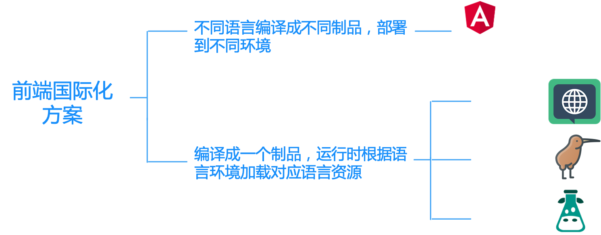

Angular-i18n 是这么做国际化的：

1. 使用源语言开发项目，并标记出需要翻译的部分，对于其中一些比较复杂的翻译场景（不同的语言有不同的复数规则和语法结构）用 **ICU** 消息格式进行标记；
2. 用 CLI 命令把标记过的文本提取到 **XLIFF** 语言包中；
3. 把 **XLIFF** 语言包为每种语言复制一份，并把这些 **XLIFF** 语言包发给翻译人员或翻译服务；
4. 在为一个或多个本地环境构建应用时，使用 CLI 合并这些翻译完成的文件；

整个过程相对比较方便，且解决了我们上面提到的一些需求，如用自动化指令抽取语言包来代替大量手动操作及用源语言标记翻译代码的需求。

> 其中涉及到的一些缩写（XLIFF/ICU/BCP47）都是一些国际化领域标准的解决方案，这里做一些简单介绍：
>
> #### XLIFF 
>
> **XLIFF**（**XML Localisation Interchange File Format**，即XML本地化交换文件格式）是一种基于XML的交换格式，旨在标准化国际化、本地化过程中在工具之间传递可本地化数据的方式。
>
> 其中可以包含一些给翻译人员提供的附加信息，使翻译人员能够更好地翻译
>
> 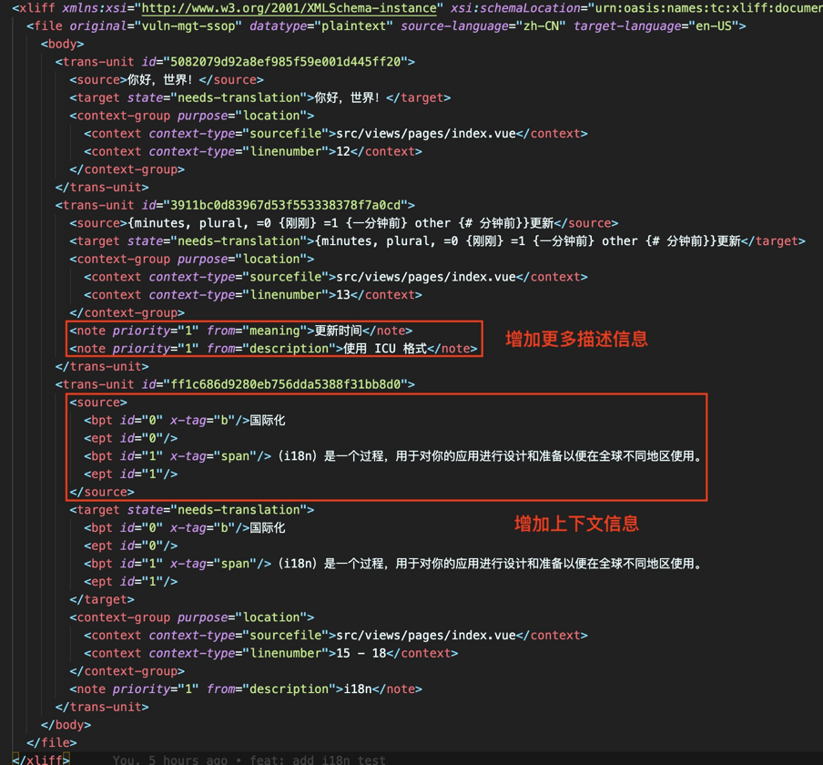
>
> 同时，也是因为 **XLIFF** 是一种标准的解决方案，应用市场上也衍生了一部分给翻译人员使用的 **XLIFF** 翻译工具，如 **XLIFF editor、Poeditor** 等，图中展示的是 **XLIFF editor** 的用法：
>
> 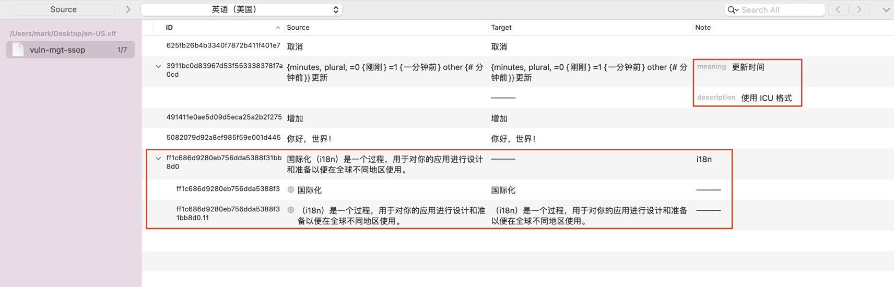
>
> #### ICU
>
> 为了国际化过程中需要根据各地的风俗和语言习惯，实现对数字、货币、时间、日期、和消息的格式化、解析，对字符串进行大小写转换、整理、搜索和排序等功能，**ICU** （International Components for Unicode，Unicode 国际化标准组件）应运而生，它其实是一套成熟、广泛使用的C/C++、Java和.NET 类库集。但我们可以利用其所提供的 [ICU 消息格式](http://userguide.icu-project.org/formatparse/messages) 定义解决我们翻译中常见的复数、选择占位等复杂形式，下图所示是用 **ICU消息格式** 表示复数的一种场景：
>
> 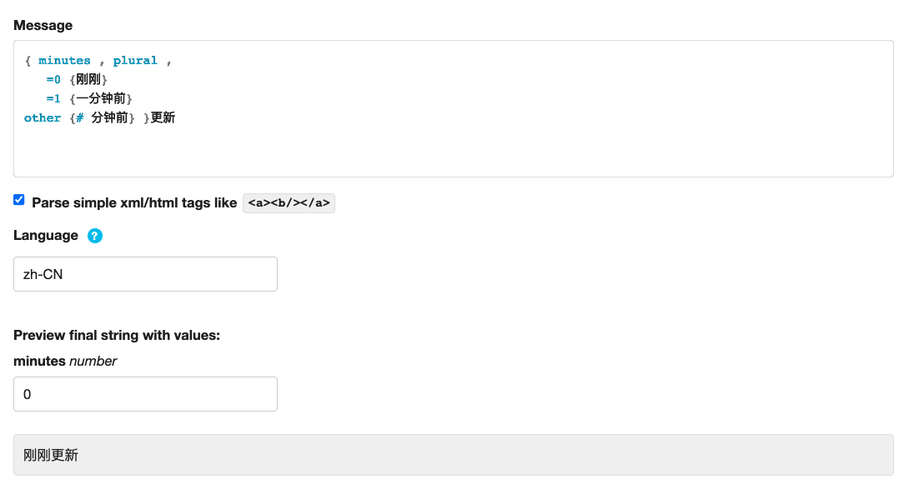

但是，**Angular i18n** 的方案应用到我们的项目也有一些问题：

1. 只提供了模版中的标记方法，对于逻辑中的文本，并没有提供一个官方的解决方案；

2. 在编译时编译成不同的制品，无法满足运行时切换不同语言环境的需求；

    

### 思考

结合以上调研的信息，我们进行了一些思考，发现前端国际化围绕语言包大致可分为两部分，即 **生产语言包** 和 **消费语言包** ，现有的前端国际化方案，在 **生产语言包** 和 **消费语言包** 两方面的表现如下图所示：

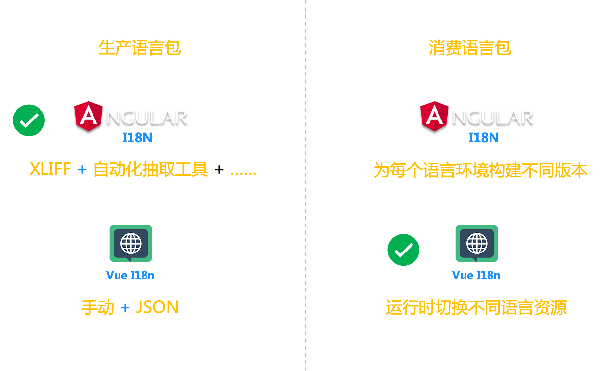


对比我们的需求：

在生产语言包方面，我们想要自动化工具代替大量手动抽取语言包的操作，而 Angular-i18n 使用自动化抽取工具抽取成国际标准的 XLIFF 语言包，正是我们可以借鉴的部分；

而在消费语言包方面，我们想要按需加载对应语言环境的语言包，并期望可以在运行时切换这些语言包，同时，对于其中比较复杂的复数等场景，我们需要一种标准化的解决方案，我们可以借鉴 Vue-i18n 运行时加载语言包的做法，同时采用 `ICU` 提供的标准解决方案解决复数等复杂场景。

综合 Angular-i18n 及 Vue-i18n 方案中可借鉴的部分，再加上一些自己的优化，就有了以下方案：


### 方案

我们来捋一下整个方案实现国际化的过程，并阐述其中的一些设计思路：

##### 1. 标记

首先，我们需要使用标记标记出需要翻译的部分：

对于普通文本，可以使用 `tx` 方法来标记，而 `tx` 方法在不同的使用场景又有不同的变种：

在 Vue 模板中，我们使用 `$tx` 来标记：

```js
$tx('你好，世界！')
```

而在 js 文件中，我们使用挂在 window 上的标记方法 `qp.i18n.tx` 进行标记：

```js
export const sayHello = (name) => {
	return `${qp.i18n.tx('你好')}, ${name}`;
}
```

如果想要给需要翻译的文本提供更多的描述信息以给翻译人员参考，可以给标记方法加入参数，比如：

```xml
<span>
  $tx('你好，世界！', '首页｜用户进入网站的欢迎界面')
</span>
```

这样写，就能将 `首页｜用户进入网站的欢迎界面` 这部分信息提供给翻译人员。

而对于复数等复杂的翻译场景，可以直接在标记方法中写 `ICU message format` ：

```xml
<span>
  $tx('{minutes, plural, =0 {刚刚} =1 {一分钟前} other {# 分钟}}更新', {minutes}, '更新时间|使用 ICU 格式')
</span>
```

我们会使用 `intl-messageformat` 这个包去翻译上述  `ICU` 特殊标记。

对于需要翻译的复杂 DOM 结构，提供 `Translate` 组件，以避免文本被 DOM 结构截断上下文信息，如：

```html
<Translate i18n="i18n">
  <b>国际化</b>
  <span>（i18n）是一个过程，用于对你的应用进行设计和准备以便在全球不同地区使用。</span>
</Translate>
```

`Translate` 组件包裹的 DOM 结构会被当作一个翻译单元提供给翻译人员。

对于一些需要从服务端获取的文本翻译信息，如字典等，也提供了 `t` 方法用于标记，沿用 `Vue-i18n`，需要定义 key 与需要翻译的文本对应。

需要注意的是，`t` 方法标记的翻译信息不会被后面将要提到的抽取工具抽取。

##### 2. 抽取语言包

对需要翻译的部分进行标记之后，就需要根据标记的文本抽取源语言包了，我们开发了命令行工具，可以用一行指令将需要翻译的部分抽取成标准的 `XLIFF` 语言包。

##### 3. 将语言包引入项目

项目中用到的语言包分为`项目中抽取的语言包` 及 `依赖的 NPM Package 中的语言包`。

- 对于从项目中抽取的 XLIFF 语言包：

抽取后的 `XLIFF` 语言包里面包含了很多提供给翻译人员的附加信息，这些信息能让翻译人员更好地翻译，但对于

项目来说，这些信息其实是冗余的，包含这些冗余信息的 `XLIFF` 文件对于项目来说体积太大，对应用的加载不太友好，可以提取其中的关键信息，生成体积更小且更容易在运行时加载的 json 文件。

于是，就有了命令行工具的第二个功能：**将 XLIFF 语言包转换为对应的 json 语言包**。转换后的 json 语言包只包含翻译单元的 key 及对应的翻译文本等信息：

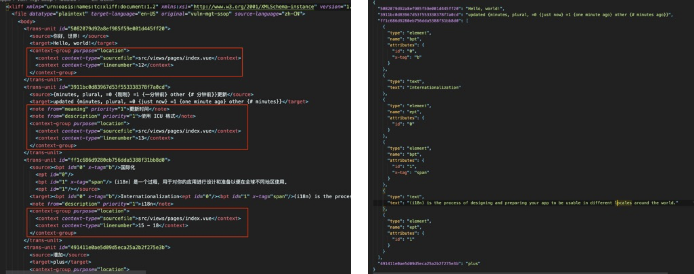

json 语言包默认将被放在 `public/locales` 目录下，vue 项目中 public 目录下的文件将不会被编译。

- 对于依赖的 NPM Package 中的语言包：

需要按照语言环境引入，每个语言环境对应一个 js 文件，该文件名称以 `BCP47` 定义的规则命名，如需要在美式英语的语言环境中使用，就需要创建名为 `en-US.js` 的文件，文件中需要 import 所有依赖的 NPM Package 中的对应语言环境的语言包，并以数组的方式 export 出去：

```js
// src/configs/dependency-locales/en-US.js
import somePackageEn from 'some-package/dist/locales/en-US.js';
import anotherPackageEn from 'another-package/dist/locales/en-US.json';

export default [somePackageEn, anotherPackageEn]; // 多个第三方 package 的语言包以数组的形式导出
```

框架会在对应的语言环境中加在对应的 js 文件中的语言包。

##### 4. 按需加载语言包

方案内置了语言包切换的策略：

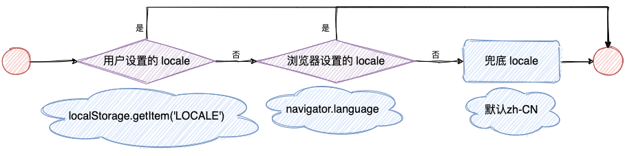

并且可以根据不同的语言环境，加载对应的语言包，具体做法是：

对于 `public/locales` 下项目中抽取的 json 语言包，采用 `window.fetch` 的方法实现按需加载；

对于 `src/configs/dependency-locales` 下依赖的 NPM Package 中的语言包，采用 webpack 中 `import()` 来实现动态加载模块；

以上，就是我们所摸索出来的基于 vue 开发的项目的前端国际化方案。

### 总结

本文所讲到的 Vue 项目的前端国际化方案汲取了很多 Angular-i18n 及 Vue-i18n 的设计思路，沿用了 XLIFF / ICU / BCP47 等国际化通用标准，并在此基础上做了一些改进，是「站在巨人的肩膀上」做的开发，后续还有很多可以扩展的地方，比如我们可能需要一个国际化翻译平台（如下图）去维护语言包的工作流（抽取、转换、集成等）

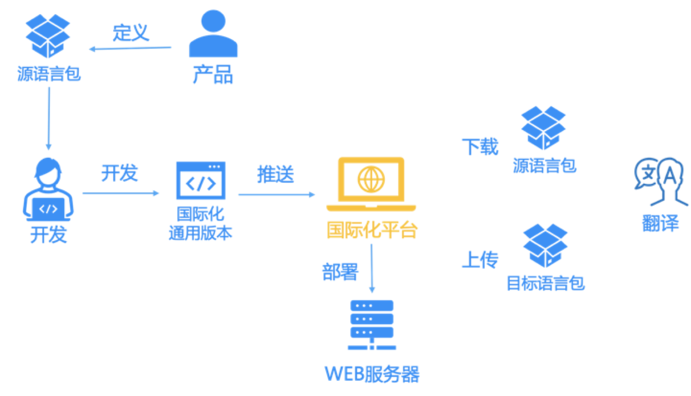

比如我们可能需要跟服务端打通，去解决字典等需要从服务端动态获取的值的国际化。

### 参考文献

XLIFF 维基百科：https://en.wikipedia.org/wiki/XLIFF

Angular i18n：https://angular.cn/guide/i18n

